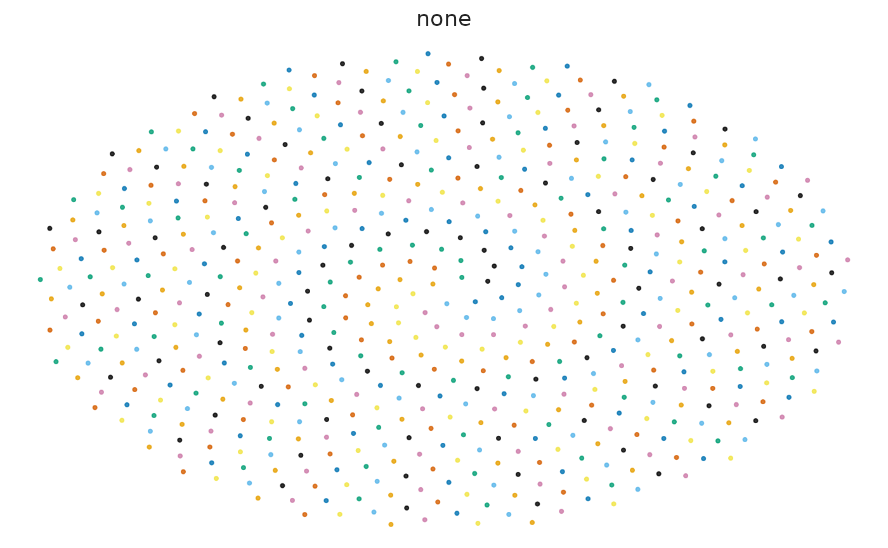
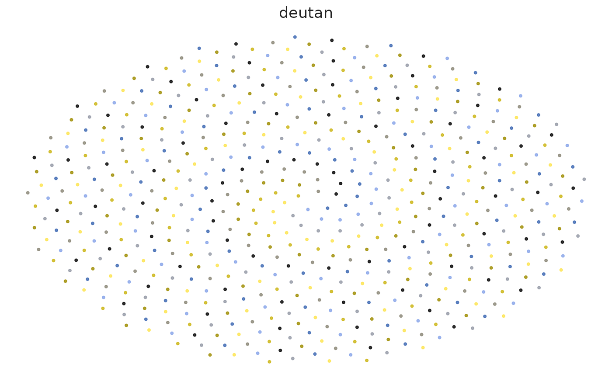
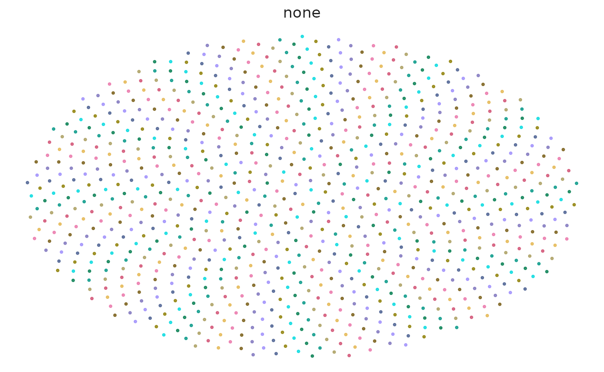
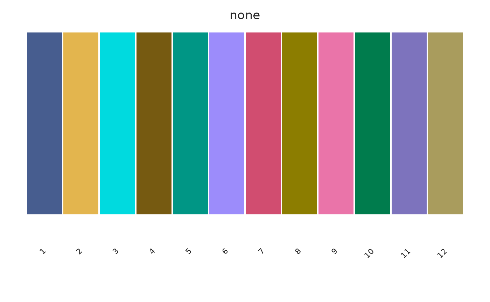

# Palette accessibility

``` r

library(scChromatic)
```

## Normal and simulated CVD views

``` r

audit <- sc_palette_audit(
  "okabe_ito",
  cvd = c("none", "deutan", "protan", "tritan")
)
audit
```

    ## <sc_palette_audit> okabe_ito
    ##  n_colors invalid_color_count duplicate_count min_distance median_distance
    ##         8                   0               0     21.72367        49.49019
    ##         worst_pair min_contrast median_contrast lightness_monotonic
    ##  #E69F00 / #F0E442     1.322328        3.241087                  NA
    ##  diverging_center_distinct
    ##                         NA

``` r

views <- sc_palette_plot(
  "okabe_ito",
  view = "points",
  cvd = c("none", "deutan", "protan", "tritan")
)
views$none
```



``` r

views$deutan
```



The audit reports minimum and median CIE2000 distances in every
requested vision simulation plus contrast against the chosen background.

## Light and dark backgrounds

``` r

sc_palette_audit("tol_muted", background = "#FFFFFF", cvd = "none")
```

    ## <sc_palette_audit> tol_muted
    ##  n_colors invalid_color_count duplicate_count min_distance median_distance
    ##         9                   0               0     15.00318        47.67533
    ##         worst_pair min_contrast median_contrast lightness_monotonic
    ##  #882255 / #AA4499     1.618128        3.662107                  NA
    ##  diverging_center_distinct
    ##                         NA

``` r

sc_palette_audit("tol_muted", background = "#1A1A1A", cvd = "none")
```

    ## <sc_palette_audit> tol_muted
    ##  n_colors invalid_color_count duplicate_count min_distance median_distance
    ##         9                   0               0     15.00318        47.67533
    ##         worst_pair min_contrast median_contrast lightness_monotonic
    ##  #882255 / #AA4499     1.429713        4.752545                  NA
    ##  diverging_center_distinct
    ##                         NA

``` r

sc_palette_recommend(
  8, use = "cell_identity", geometry = "point", background = "dark"
)
```

    ##   palette_id
    ## 4  chromatic
    ## 2  tol_muted
    ## 3    ditto40
    ## 1  okabe_ito
    ##                                                                         reason
    ## 4 qualitative; registered for this use; recommended; sufficient fixed capacity
    ## 2 qualitative; registered for this use; recommended; sufficient fixed capacity
    ## 3 qualitative; registered for this use; recommended; sufficient fixed capacity
    ## 1 qualitative; registered for this use; recommended; sufficient fixed capacity
    ##   capacity      status min_cie2000    score
    ## 4       40 recommended    12.38083 83.38083
    ## 2        9 recommended    11.82594 82.82594
    ## 3       40 recommended    11.13303 82.13303
    ## 1        8 recommended    11.13303 82.13303

## Point versus fill geometry

Small dense points are harder to distinguish than broad filled regions.
Registry recommendations therefore include geometry and background
metadata; contrast values are diagnostics rather than automatic WCAG
pass/fail claims for plot marks.

``` r

sc_palette_plot("chromatic", n = 12, view = "points", cvd = "none")
```



``` r

sc_palette_plot("chromatic", n = 12, view = "swatch", cvd = "none")
```



## High-cardinality limitations

No 30- or 40-color sequence is universally color-blind safe. At high
cardinality, combine color with direct labels, facets, shapes, line
types, spatial separation, or interactive lookup. Use hierarchy maps
when subtype similarity should be explicit.

``` r

sc_hierarchy_map(
  parent = c("Lymphoid", "Lymphoid", "Lymphoid", "Myeloid", "Myeloid"),
  child = c("B", "T", "NK", "Mono", "DC")
)
```

    ## <sc_color_map[5]> palette: hierarchy:tol_muted; background: light
    ##   B: #833744
    ##   NK: #C76A79
    ##   T: #FF9FB1
    ##   DC: #453F7B
    ##   Mono: #675EB4
