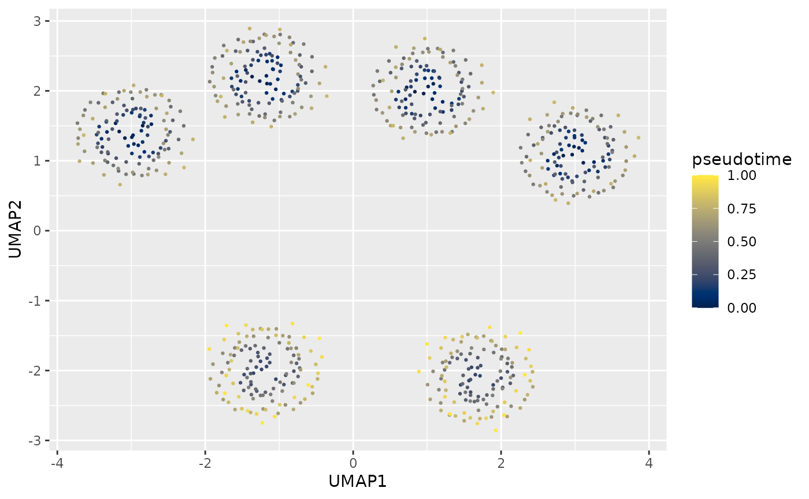
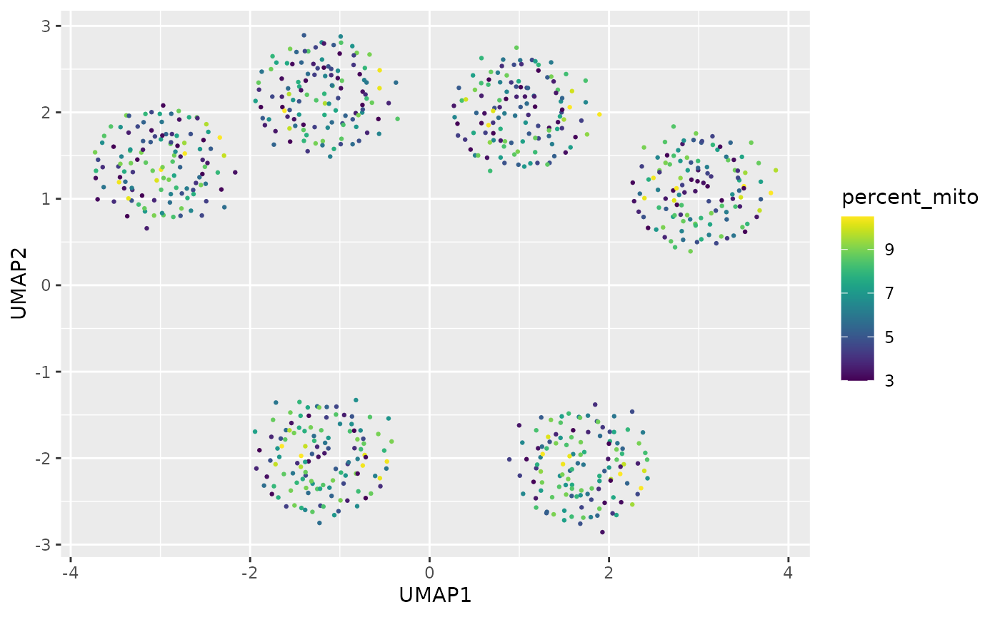

# scChromatic

``` r

library(scChromatic)
library(ggplot2)
data(sc_example)
```

## Palette discovery

The registry separates palette type, intended use, provenance, capacity,
and status.

``` r

head(sc_palette_names(type = "qualitative"))
```

    ## [1] "okabe_ito"           "tol_bright"          "tol_vibrant"        
    ## [4] "tol_muted"           "tol_medium_contrast" "glasbey32"

``` r

sc_palette_info("chromatic")
```

    ##   palette_id      source source_palette palette_type max_n
    ## 9  chromatic scChromatic      chromatic  qualitative    40
    ##                                      intended_use recommended_geometry
    ## 9 cell_identity,sample,lineage,heatmap_annotation      point,fill,line
    ##   recommended_background      status
    ## 9             light,dark recommended
    ##                                                          source_order
    ## 9 deterministically regenerated by data-raw/generate-owned-palettes.R
    ##                                       priority_order
    ## 9 frozen nested maximin order; each prefix is stable
    ##                              source_url source_version source_commit
    ## 9 https://github.com/xie186/scChromatic           <NA>          <NA>
    ##   source_sha256                    citation    license derived
    ## 9          <NA> scChromatic package authors GPL (>= 3)    TRUE
    ##                                                     source_cvd_claim
    ## 9 Perceptually optimized and audited; no universal CVD-safety claim.
    ##                                                                          notes
    ## 9 Frozen nested maximin sequence generated in HCL with normal/CVD diagnostics.
    ##   audit_min_cie2000 audit_min_cie2000_deutan audit_min_cie2000_protan
    ## 9           6.44697                 3.749774                 3.879291
    ##   audit_min_cie2000_tritan audit_min_contrast_light audit_min_contrast_dark
    ## 9                 3.877646                 1.736383                2.677194
    ##   audit_n                            audit_basis
    ## 9      40 stored priority-order reference vector
    ##                                                      audit_method audit_date
    ## 9 CIEDE2000 via farver 2.1.2; CVD simulation via colorspace 2.1.3 2026-08-04

``` r

sc_palette_recommend(12, use = "cell_identity")
```

    ##   palette_id
    ## 4  chromatic
    ## 3    ditto40
    ##                                                                         reason
    ## 4 qualitative; registered for this use; recommended; sufficient fixed capacity
    ## 3 qualitative; registered for this use; recommended; sufficient fixed capacity
    ##   capacity      status min_cie2000    score
    ## 4       40 recommended   10.877739 81.87774
    ## 3       40 recommended    2.000239 73.00024

Raw colors are available as vectors, while
[`sc_pal()`](https://xie186.github.io/scChromatic/reference/sc_pal.md)
returns a scales-compatible closure.

``` r

sc_palette("chromatic", 6)
```

    ## [1] "#475D8F" "#E3B54E" "#00DADF" "#765A11" "#009685" "#9C8CFB"

``` r

sc_pal("chromatic")(6)
```

    ## [1] "#475D8F" "#E3B54E" "#00DADF" "#765A11" "#009685" "#9C8CFB"

## Example single-cell dataset

`sc_example` is deterministic and synthetic. Its columns represent the
color semantics commonly encountered in single-cell figures.

``` r

dim(sc_example)
```

    ## [1] 720  12

``` r

head(sc_example)
```

    ##     cell_id     UMAP1    UMAP2 cell_type  lineage   sample  condition MS4A1
    ## 1 cell_0001 -3.163181 1.418680    B cell Lymphoid Sample 1    Control 3.850
    ## 2 cell_0002 -3.086307 1.324727    B cell Lymphoid Sample 2    Control 3.899
    ## 3 cell_0003 -2.846043 1.502208    B cell Lymphoid Sample 3 Stimulated 4.145
    ## 4 cell_0004 -2.992542 1.337283    B cell Lymphoid Sample 4 Stimulated 4.189
    ## 5 cell_0005 -2.976398 1.365888    B cell Lymphoid Sample 1    Control 4.029
    ## 6 cell_0006 -3.212464 1.536336    B cell Lymphoid Sample 2    Control 4.065
    ##   signed_score pseudotime percent_mito n_counts
    ## 1       -0.494      0.000         8.66     2279
    ## 2       -0.473      0.007         8.78     2257
    ## 3        1.341      0.013         8.87     2483
    ## 4        1.349      0.020        10.44     2460
    ## 5       -0.451      0.027         8.98     2185
    ## 6       -0.457      0.034         9.00     2160

## Persistent cell identities

``` r

cell_map <- sc_color_map(sc_example$cell_type, palette = "chromatic")

ggplot(sc_example, aes(UMAP1, UMAP2, color = cell_type)) +
  geom_point(size = 0.5) +
  scale_color_sc_map(cell_map)
```


The same map is reused after filtering, so the three retained identities
keep their original colors.

``` r

stimulated <- subset(
  sc_example,
  condition == "Stimulated" & cell_type %in% c("CD4 T", "NK", "Monocyte")
)

ggplot(stimulated, aes(UMAP1, UMAP2, color = cell_type)) +
  geom_point(size = 0.7) +
  scale_color_sc_map(cell_map)
```


## Choosing a ggplot2 scale

Choose a scale from both the mapped data and the ggplot2 aesthetic:

| Mapped data and assignment strategy | `color` or `colour` aesthetic | `fill` aesthetic |
|:---|:---|:---|
| Categorical, assigned for one plot | [`scale_color_sc_d()`](https://xie186.github.io/scChromatic/reference/scale_color_sc_d.md) | [`scale_fill_sc_d()`](https://xie186.github.io/scChromatic/reference/scale_color_sc_d.md) |
| Categorical, locked in an `sc_color_map` | [`scale_color_sc_map()`](https://xie186.github.io/scChromatic/reference/scale_color_sc_map.md) | [`scale_fill_sc_map()`](https://xie186.github.io/scChromatic/reference/scale_color_sc_map.md) |
| Numeric, shown as a gradient | [`scale_color_sc_c()`](https://xie186.github.io/scChromatic/reference/scale_color_sc_c.md) | [`scale_fill_sc_c()`](https://xie186.github.io/scChromatic/reference/scale_color_sc_c.md) |

The `color` aesthetic controls points, lines, text, and geometry
outlines; `fill` controls the interiors of violins, bars, tiles,
polygons, and other filled geometries. The `scale_colour_*()` functions
are exact aliases of the corresponding `scale_color_*()` functions.
Match the scale to the aesthetic in
[`aes()`](https://ggplot2.tidyverse.org/reference/aes.html): mapping
`fill = sample` requires a `scale_fill_*()` scale, while mapping
`color = sample` requires a `scale_color_*()` scale.

Use the `_sc_map()` family when categories must keep the same colors
across figures, subsets, or reordered factors. A single map can drive
either aesthetic.

``` r

sample_map <- sc_color_map(sc_example$sample, palette = "chromatic")

ggplot(sc_example, aes(UMAP1, UMAP2, color = sample)) +
  geom_point(size = 0.5) +
  scale_color_sc_map(sample_map)
```


``` r

ggplot(sc_example, aes(sample, n_counts, fill = sample)) +
  geom_violin() +
  scale_y_log10() +
  scale_fill_sc_map(sample_map) +
  labs(x = NULL, y = "Library size")
```


Use `_sc_d()` for a one-off categorical plot where a persistent
assignment is not needed. Its assignments are computed from the discrete
levels supplied to that plot.

``` r

ggplot(sc_example, aes(UMAP1, UMAP2, color = condition)) +
  geom_point(size = 0.5) +
  scale_color_sc_d("chromatic")
```


Use `_sc_c()` only for numeric values. Sequential, diverging, or cyclic
palettes are valid for continuous scales; qualitative palettes are not.
If a category is stored as numbers, convert it to a factor before using
`_sc_d()` or constructing an `sc_color_map`.

These rules do not depend on the source object. For a Seurat object,
`object[[]]` supplies its metadata data frame and `object$sample`
supplies the sample vector used to construct a map. A plot returned by
another package, including pixelatorR, must still use the scale matching
the aesthetic mapped by that plot. If both `color` and `fill` are
mapped, add one scale for each aesthetic; otherwise, use only the scale
that matches
[`aes()`](https://ggplot2.tidyverse.org/reference/aes.html).

## Continuous expression

``` r

ggplot(sc_example, aes(UMAP1, UMAP2, color = MS4A1)) +
  geom_point(size = 0.5) +
  scale_color_sc_c("viridis")
```


## Signed scores centered at zero

`midpoint = 0` changes data rescaling, not merely the middle displayed
color.

``` r

ggplot(sc_example, aes(UMAP1, UMAP2, color = signed_score)) +
  geom_point(size = 0.5) +
  scale_color_sc_c("chromatic_balance", midpoint = 0)
```


## Parent lineage and child subtype colors

``` r

lineage_map <- sc_hierarchy_map(sc_example$lineage, sc_example$cell_type)

ggplot(sc_example, aes(UMAP1, UMAP2, color = cell_type)) +
  geom_point(size = 0.5) +
  scale_color_sc_map(lineage_map)
```


## Pseudotime and QC

``` r

ggplot(sc_example, aes(UMAP1, UMAP2, color = pseudotime)) +
  geom_point(size = 0.5) +
  scale_color_sc_c("cividis")
```



``` r

ggplot(sc_example, aes(UMAP1, UMAP2, color = percent_mito)) +
  geom_point(size = 0.5) +
  scale_color_sc_c("viridis")
```


