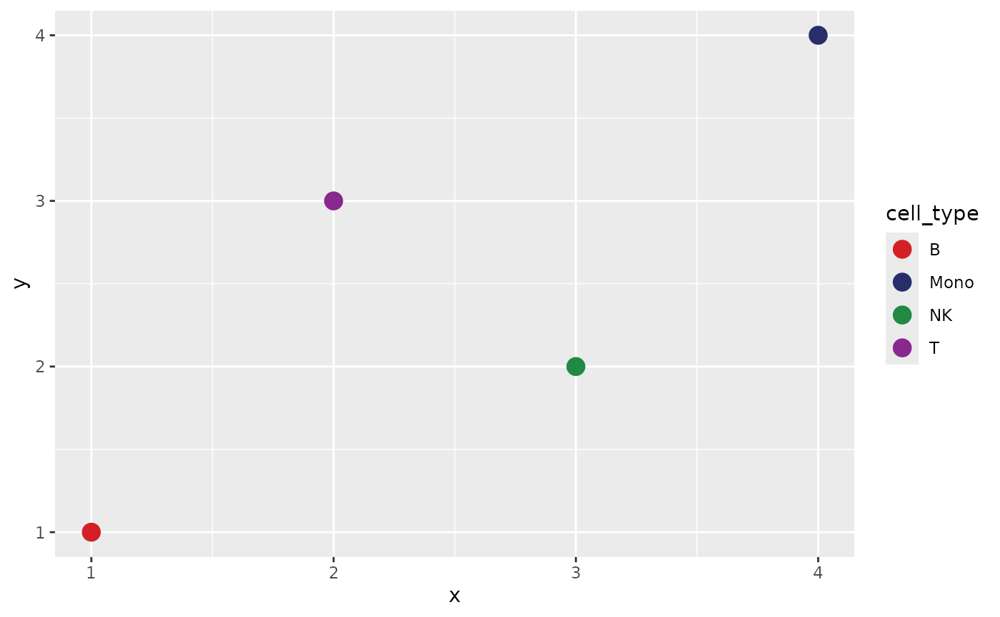

# Stable color maps

``` r

library(scChromatic)
library(ggplot2)
```

## Define the mapping from the full annotation

``` r

labels_full <- c("B", "T", "NK", "Mono")
map <- sc_color_map(labels_full, palette = "archr_stallion")
as_named_colors(map)
```

    ##         B      Mono        NK         T 
    ## "#D51F26" "#272E6A" "#208A42" "#89288F"

Subsets select names from the same object; they never rerun positional
palette assignment.

``` r

labels_subset <- c("T", "NK")
subset_colors <- as_named_colors(map)[labels_subset]
stopifnot(identical(
  subset_colors,
  as_named_colors(map)[c("T", "NK")]
))
```

Factor reordering also leaves the contract intact.

``` r

reordered <- factor(labels_full, levels = rev(labels_full))
as_named_colors(map)[levels(reordered)]
```

    ##      Mono        NK         T         B 
    ## "#272E6A" "#208A42" "#89288F" "#D51F26"

## Add a new annotation

``` r

updated <- update_sc_color_map(map, c(labels_full, "DC"))
stopifnot(identical(
  as_named_colors(updated)[names(as_named_colors(map))],
  as_named_colors(map)
))
```

## Export and restore

JSON is used when jsonlite is installed. CSV is always a transparent
fallback.

``` r

path <- tempfile(fileext = ".json")
write_sc_color_map(updated, path)
restored <- read_sc_color_map(path)
stopifnot(identical(as_named_colors(restored), as_named_colors(updated)))
```

## Plot and framework interoperability

``` r

dat <- data.frame(
  x = seq_along(labels_full),
  y = c(1, 3, 2, 4),
  cell_type = labels_full
)
ggplot(dat, aes(x, y, color = cell_type)) +
  geom_point(size = 4) +
  scale_color_sc_map(map)
```



`as_named_colors(map)` is a plain named character vector. It can be
passed to Seurat manual scales, SingleCellExperiment plotting code,
ArchR color arguments, or
[`ComplexHeatmap::HeatmapAnnotation()`](https://rdrr.io/pkg/ComplexHeatmap/man/HeatmapAnnotation.html)
without loading any of those frameworks in scChromatic.
